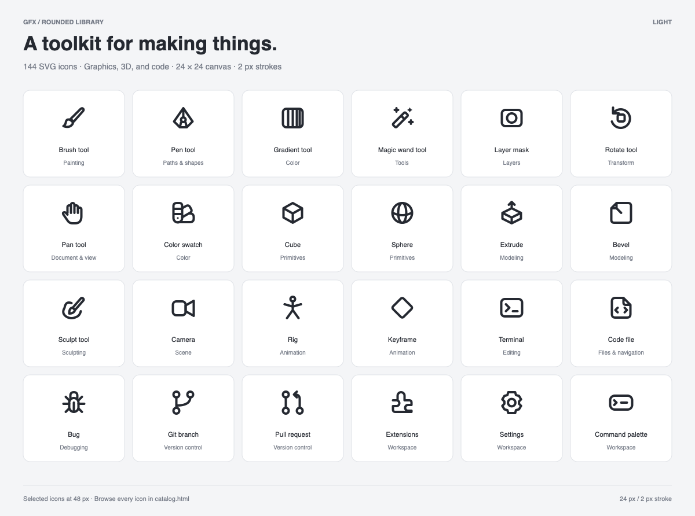

# LuciaOS Assets

Shared visual assets for LuciaOS and its tools.

## Rounded icons

**144 editable SVG icons** for graphics editing, 3D applications, and code editors.

| Domain | Count |
| --- | ---: |
| Graphics & shared controls | 67 |
| 3D tools | 40 |
| Code editor | 37 |

Every icon is a standalone SVG on a 24 × 24 canvas with a 2 px stroke, a
transparent background, and `currentColor`, so it inherits the surrounding CSS
color. The set also ships a symbol sprite, metadata with search keywords,
light and dark preview sheets, and actual-size samples.

- [Usage, design notes, and rebuild instructions](rounded/README.md)
- [Full icon index](rounded/ICONS.md)
- [Searchable catalog](rounded/catalog.html) — open it locally; it has no network dependencies
- [Metadata](rounded/catalog.json) — stable IDs, names, domains, categories, keywords

Source SVGs are in [`rounded/icons/`](rounded/icons). They are the editable
originals; the sprite, catalog, and previews are rebuilt from them with
`python3 rounded/scripts/build_previews.py`, which uses only the Python
standard library.
