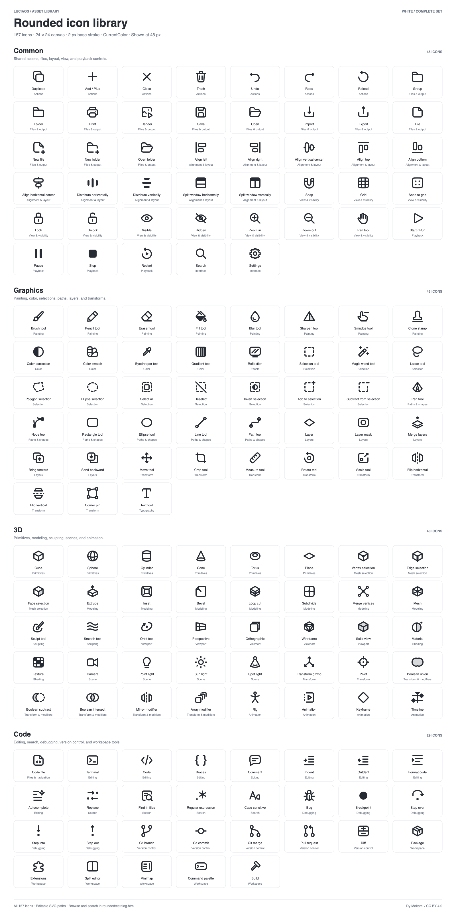

# LuciaOS Assets

The shared asset library for LuciaOS and related projects.

## Rounded icons

**157 editable SVG icons**, organized into thematic folders. Every icon uses a
24 × 24 canvas, a 2 px base stroke, transparent background, and `currentColor`.

| Collection | Icons | Location |
| --- | ---: | --- |
| Common controls | 45 | [`rounded/icons/common/`](rounded/icons/common/) |
| Graphics editing | 43 | [`rounded/icons/graphics/`](rounded/icons/graphics/) |
| 3D tools | 40 | [`rounded/icons/3d/`](rounded/icons/3d/) |
| Code editing | 29 | [`rounded/icons/code/`](rounded/icons/code/) |

Each collection has functional subfolders such as `files`, `painting`,
`primitives`, or `debugging`. Shared controls live in `common/` so applications
can reuse the same assets.

## Complete preview sheets

Both sheets contain **all 157 icons**, with names and categories:

- **White:** [PNG](rounded/previews/all-white.png) · [SVG](rounded/previews/all-white.svg)
- **Dark:** [PNG](rounded/previews/all-dark.png) · [SVG](rounded/previews/all-dark.svg)

The PNGs are 1600 × 3204 px; the SVG sheets can be scaled freely.



## Browse and use

- [Searchable catalog](rounded/catalog.html) — offline search, collection/theme filters, copy, and download
- [Full icon index](rounded/ICONS.md)
- [Usage and design notes](rounded/README.md)
- [Metadata](rounded/catalog.json) — the source of truth for names, paths, IDs, and keywords
- [Symbol sprite](rounded/sprite.svg) — existing symbol IDs remain unchanged

Icons now live under `rounded/icons/<collection>/<theme>/`. Filenames and SVG
artwork are unchanged. For existing direct imports, use the [old-to-new path
map](rounded/path-migrations.json).

## Rebuild

From the repository root:

```sh
python3 rounded/scripts/build_previews.py
```

This uses Python's standard library to rebuild the sprite, searchable catalog,
icon index, and both full SVG sheets from the source SVGs and `catalog.json`.

To export the PNG sheets on macOS, using the built-in Quick Look and `sips`:

```sh
python3 rounded/scripts/render_previews.py
```

## License

Copyright © 2026 Dy Mokomi.

These assets are licensed under the
[Creative Commons Attribution 4.0 International License](LICENSE). You may
share and adapt them for any purpose, including commercially, as long as you
give appropriate credit, link to the license, and say whether you made
changes.

Suggested credit:

```text
Rounded icons by Dy Mokomi (https://github.com/dymokomi/luciaos-assets),
licensed under CC BY 4.0.
```
